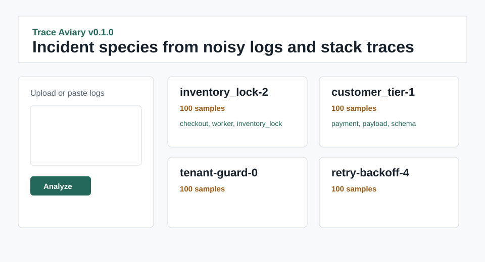

# Trace Aviary

[](https://github.com/KanadeK/trace-aviary/actions/workflows/ci.yml)
[](LICENSE)
[](https://github.com/KanadeK/trace-aviary/releases)

Trace Aviary clusters logs and stack traces into "incident species": repeated failure families with representative samples, shared symptoms, time buckets, and a minimal reproduction hypothesis.



Core value:

- Normalize timestamps, paths, IDs, and dynamic values so request noise does not split one root cause.
- Use deterministic local TF-IDF clustering without online models.
- Export an incident catalog that on-call engineers can review and hand to owners.

## Install

```bash
python -m pip install -e ".[dev]"
```

## Quick Start

```bash
trace-aviary sample --output examples/synthetic_logs.jsonl
trace-aviary analyze examples/synthetic_logs.jsonl --clusters 5 --output dist-release/incident_catalog.json
trace-aviary demo
uvicorn trace_aviary.api:app --reload
```

Input JSONL:

```json
{"timestamp":"2026-07-01T00:00:00Z","level":"ERROR","message":"checkout worker timed out acquiring inventory_lock request_id=req_12345678","stack":"File \"/srv/app/cart.py\", line 30, in inventory.lock_stock"}
```

Output catalog excerpt:

```json
{
  "total_events": 500,
  "clusters": [
    {
      "sample_count": 100,
      "common_tokens": ["inventory_lock", "checkout", "worker"],
      "reproduction_hypothesis": "Reproduce by replaying an input that reaches the representative failure path..."
    }
  ]
}
```

## Features

- Plain text, JSONL, and Sentry-style JSON import.
- Path, ID, timestamp, number, email, and common secret normalization.
- TF-IDF clustering with deterministic KMeans.
- Representative stack selection, common tokens, time distribution, and sample counts.
- JSON and Markdown incident catalog export.
- CLI, FastAPI UI, SQLite persistence adapter, synthetic fixture generator, and static Pages demo.

## Non-goals

- No online LLM calls.
- No production log shipping agent.
- No guarantee that secret masking catches every sensitive value.

## Architecture

The domain core lives in `src/trace_aviary/domain` and is testable without UI or network access. Adapters handle files, samples, and SQLite. CLI and FastAPI call the same catalog service.

## Testing

```bash
python -m ruff check .
python -m mypy src
PYTEST_DISABLE_PLUGIN_AUTOLOAD=1 python -m pytest -p pytest_cov -q --cov=src --cov-report=term-missing --cov-fail-under=80
python -m build
make verify
make demo
make package
make release-check
```

The synthetic sample has 500 events, five known root causes, fixed seed, and tests requiring high Adjusted Rand Index.

## Privacy

Trace Aviary is local-first and masks common token/password shapes before catalog export. Do not upload unredacted production logs to public issues, Pages, or release assets.

## Competitor Scan

Public repository sampling on 2026-07-18 did not find a same-name active project or a highly isomorphic active project. See `docs/COMPETITOR_SCAN.md` for the bounded scan.

## Roadmap

- Configurable clustering strategies and threshold sweeps.
- More import adapters for common observability exports.
- HTML catalog export with keyboard triage affordances.

## FAQ

**Does Trace Aviary use online AI models?** No.

**Can dynamic request IDs cause over-splitting?** The normalizer replaces common request, trace, span, and session IDs before vectorization.

**Can I use it with private logs?** Yes locally, but review exports before sharing.
